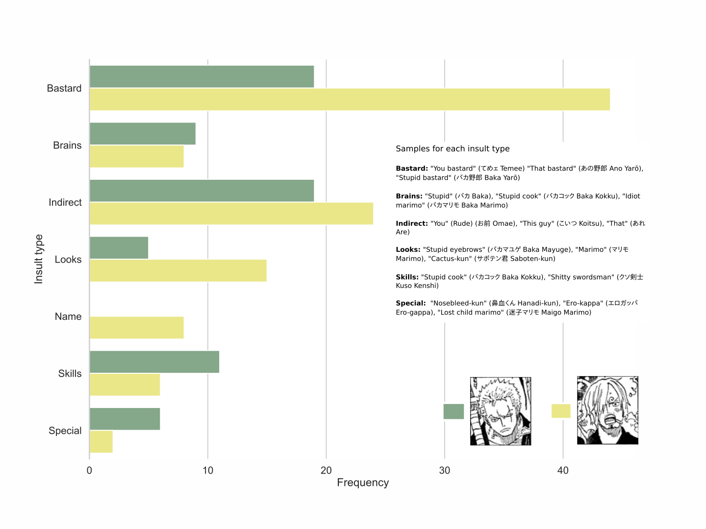

# Zoro and Sanji's Insults

Zoro and Sanji's rivalry and especially their namecalling has been a decades-long ongoing running gag in the One Piece universe. Inspired by [this comment]() on the r/onepiece subreddit I decided to look into the details of their profanities.

## Data

I extracted the the data curated by a user in the [One Piece Wiki](https://onepiece.fandom.com/wiki/SBS_Volume_73) covering chapters 36 to 656 which represents roughly 62% of all currently released chapters (994 chapters published at the time of writing).

I then used GSheets to quickly tabularize the data from the Wiki and had to manually clean the data, Python to create the visualization, some minor edits in Inkscape.

I've provided the spreadsheet [here](https://docs.google.com/spreadsheets/d/1CkkOjt48RbNBzBsvgDNI23TFy18jM0PlmhsSCza_-NY/edit?usp=sharing).

## Method

Composite insults have been counted for both categories. E.g., "idiot swordsman" would appear twice in this graph. I.e., the bars won't add up the total number of insults. However, I wanted to capture the beauty of various insults like "Marimo swordsman" or "Shittly lost child bastard"

Enjoy!
